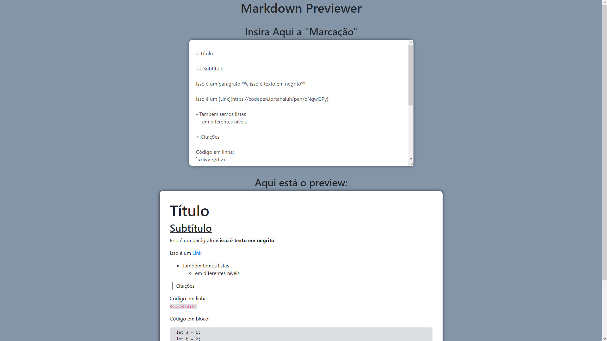

<h1 align="center">
   Markdown Previewer
</h1>

## 
 <u>Preview da página:</u> 

  

> A página em react exibe um editor de markdown que ao ser modificado atualiza um preview instântaneamente.

<h4 align="center"><a href="https://tahaluh.github.io/markdown-previewer-fcc/" target="_blank">Clique para visitar o projeto</a></h4>

---
# 💼 Tecnologias Utilizadas

As seguintes ferramentas foram usadas na construção do projeto:

- Html
- Css
- Bootstrap
- Javascript
- React

*Também foram aplicados conceitos de responsividade*

---

Feito por Thauã Magalhães 👋🏽 Entre em contato!

 

